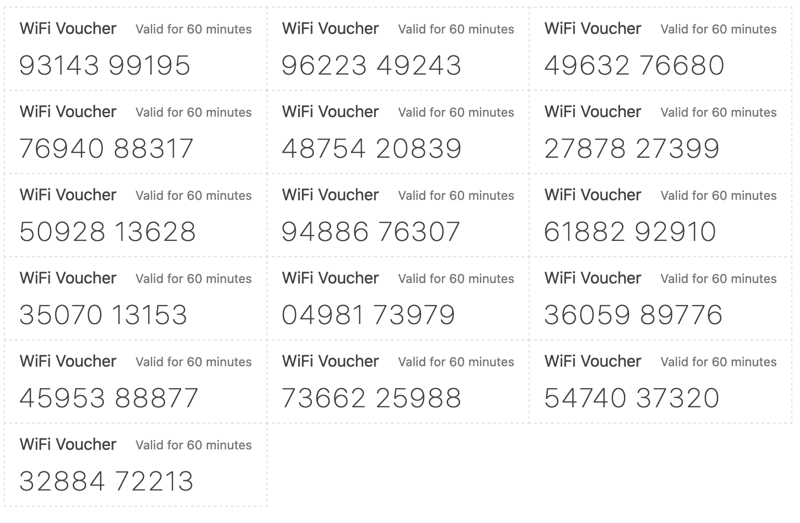

# UniFi Voucher Generator

Generates printable WiFi vouchers from a UniFi controller. Outputs a ready-to-print HTML file with styled voucher cards.

Supports both **legacy UniFi Controller** (5.x – 8.x) and modern **UniFi OS** devices (Dream Machine, UDM Pro, Cloud Key Gen 2+).



## Requirements

- Python 3.6 or later
- Network access to your UniFi controller

## Quick Start

```bash
# Supply credentials via environment variables
export UNIFI_HOST=https://192.168.1.1
export UNIFI_USERNAME=admin
export UNIFI_PASSWORD=yourpassword

# Generate 10 vouchers valid for 1 hour (default)
python3 generate.py

# Open vouchers.html in a browser and print
```

## Usage

```
python3 generate.py [OPTIONS]
```

### Connection options

| Option | Environment variable | Description |
|--------|----------------------|-------------|
| `--host URL` | `UNIFI_HOST` | Controller URL (e.g. `https://192.168.1.1`) |
| `--username USER` | `UNIFI_USERNAME` | Controller username |
| `--password PASS` | `UNIFI_PASSWORD` | Controller password |
| `--site SITE` | `UNIFI_SITE` | Site name (default: `default`) |
| `--unifi-os` | | Use UniFi OS API (Dream Machine, UDM Pro, etc.) |
| `--verify-ssl` | | Verify SSL certificate (off by default for self-signed certs) |

### Voucher options

| Option | Default | Description |
|--------|---------|-------------|
| `-m, --minutes N` | `60` | Validity in minutes |
| `-n, --count N` | `10` | Number of vouchers to generate |
| `--note TEXT` | | Free-text note attached to each voucher |
| `--usage N` | `0` | `0` = unlimited, `1` = single-use, `N` = N uses |
| `--down KBPS` | | Download bandwidth cap in kbps |
| `--up KBPS` | | Upload bandwidth cap in kbps |
| `--data MB` | | Data usage cap in MB |

### Output options

| Option | Default | Description |
|--------|---------|-------------|
| `--title TEXT` | `WiFi Voucher` | Title printed on each voucher card |
| `-o, --output FILE` | `vouchers.html` | Output HTML file |
| `--css FILE` | `style.css` | Path to CSS stylesheet |

### Examples

```bash
# 20 two-hour vouchers with a note
python3 generate.py -m 120 -n 20 --note "Conference Day 1"

# Single-use day passes with bandwidth limits
python3 generate.py -m 1440 -n 50 --usage 1 --down 10000 --up 5000

# UniFi OS device (Dream Machine / UDM Pro)
python3 generate.py --unifi-os \
    --host https://192.168.1.1 --username admin --password secret

# Custom title and output file
python3 generate.py --title "Guest Wi-Fi" -o guest-vouchers.html
```

## Customising the voucher layout

Edit `style.css` to change fonts, colours, and card dimensions.

## Controller compatibility

| Controller type | Extra flag required |
|-----------------|---------------------|
| UniFi Controller 5.x – 8.x (self-hosted) | *(none)* |
| UniFi Network Application on UniFi OS | `--unifi-os` |
| Dream Machine / UDM Pro / UDM SE | `--unifi-os` |
| Cloud Key Gen 2 (with UniFi OS) | `--unifi-os` |

> **Note:** SSL certificate verification is disabled by default because most
> self-hosted controllers use self-signed certificates. Pass `--verify-ssl`
> when connecting to a controller with a valid certificate.

## License

This is free and unencumbered software released into the public domain. See [LICENSE](LICENSE).
